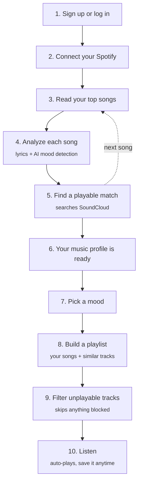

# MoodWave — Frontend

The app you actually see and use for [MoodWave](https://moodwave-frontend.vercel.app) — connect Spotify, pick a mood, and get a playlist you can listen to right there.

Backend repo: [moodwave-backend](https://github.com/Carleton-BIT/moodwave-backend)
Live app: `https://moodwave-frontend.vercel.app`

## Built with

- **React** + **Vite**
- **Tailwind CSS** for styling
- A few animation/3D libraries for the visual background effects
- The **SoundCloud player**, embedded invisibly so songs can play in-app

## How it all fits together



Steps 3–6 happen on the backend when you connect Spotify; steps 7–10 happen here in this app. Full details in the [backend README](https://github.com/Carleton-BIT/moodwave-backend).

## What's in the app

- **Sign up / Log in**
- **Home** — landing page after logging in
- **Connect Spotify** — links your Spotify account
- **Player** — pick a mood, get a playlist, and play it
- **Profile** — your saved playlists and listening stats

## Running it locally

You'll need Node 18+.

```bash
git clone https://github.com/Carleton-BIT/MoodWave-Frontend.git
cd MoodWave-Frontend

npm install
npm run dev
```

Then open `http://localhost:5173`. By default it talks to the live backend, so you don't need to run the backend yourself just to try it out.

## Useful commands

- `npm run dev` — run it locally
- `npm run build` — build for production
- `npm run lint` — check the code for issues

## Good to know

- Playback depends on finding the song on SoundCloud — most songs work, but not every song exists there, so playlists occasionally come up a little shorter than expected.
